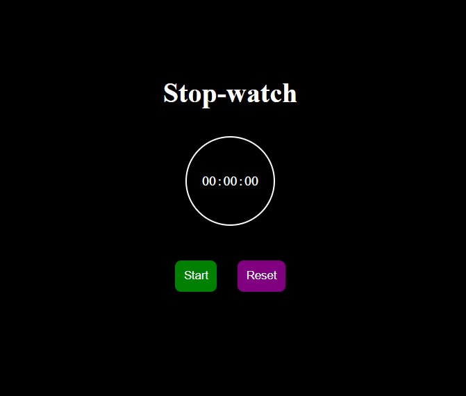

# ⏱️ Stopwatch

A simple **Stopwatch Web App** built using **HTML, CSS, and JavaScript**.  
It allows you to **start, stop, and reset** the timer with a clean and minimal UI.

---

## 🚀 Features
- Start the stopwatch  
- Stop the stopwatch  
- Reset the stopwatch  
- Hours, minutes, and seconds tracking  
- Simple and responsive design  

---


---

## 🖼️ Screenshot


---

## 🎮 How to Use
1. Open `index.html` in your browser.  
2. Click **Start** to begin the stopwatch.  
3. Click **Stop** to pause the time.  
4. Click **Reset** to reset the stopwatch back to `00:00:00`.  

---

## ⚡ Installation (Optional)
If you want to clone and run locally:  
```bash
git clone https://github.com/muhammad-husnain-ali-web/Stop-Watch.git
```

---

Then just open `index.html` in your browser.
